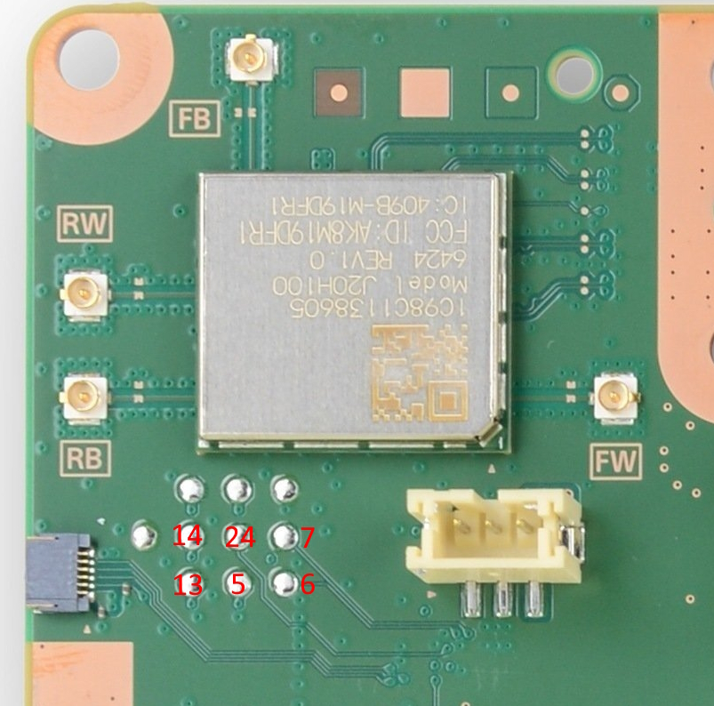

## 24 pin header near salina (EDM-010)
```
emc header
 1  5v
 2  5v
 3  gnd
 4  gnd
 5  emc gpio a1. pulling low at emc boot causes emc rom to enter uart shell @ 460800
 6  uart rx emc 115200
 7  uart tx emc 115200
 8  3v3, goes low when emc resets
 9  0v?
10  gnd
11  titania uart0 tx (efc fw: 460800)
12  titania uart0 rx (efc fw: 460800)
13  titania uart1 rx (bootrom: 460800, eap fw, apu: 230400)
14  titania uart1 tx (bootrom: 460800, eap fw, apu: 230400)
15  gnd
16  emc gpio c5 ("GPI SW" (only used if devif_det# active))
17  0v?
18  5v?
19  emc gpio a49 (devif_det#)
20  emc gpio a27. main power switch
21  i2c data (i2c_bus_4)
22  i2c clock (i2c_bus_4)
23  gnd
24  emc reset#

i2c_bus_4 contains mainly power management stuff:
(7bit addrs, 400khz)
1f      pca9557_gpioexpander    CP/dev only
2c      ad5272_nand             titania nand
2e      ad5272_g6_2             gddr6
2f      ad5272_g6_1             gddr6
51      rt5127_pmic             titania pmic
58      ds80pci102_redriver
64      rt5069_pmic             salina pmic. actually rt5126 (EDM-010) or da9081 (EDM-020) on ps5

emc gpio a 4,5,6,7(cs0:efc),8(cs1:floyd) - emc-efc spi bus (shared with floyd)

emc gpio a16 goes to rt5126 pin 13/rt5127 pin 44. set hi with pg2

emc gpio a29 - efc reset#
emc gpio a30 - titania bootmode (0: nand, 1: uart)
    to patch out emc's efc irq handler: emc.fcddr_write(0xa0113200, bytes.fromhex('7047'))
        prevents eventflg 8 being sent to task
    uart boot is on uart1 (eap uart @ 460800).
    known cmds:
        info: prints "t2.0.100.041\nEC5E98BF84CC.C.1"
        down: enters xmodem1k/crc
            0x03060000 when hdr.cpu is 0x99
        run: (sigchecks/decrypts?) downloaded data and execs
            0x030B0000 if called without doing down first
            0x06020000 if passed completely invalid data
            0x06020001 if hdr.cpu is 4. weird!!
            0x010100xx if hdr.cpu is not in (1,2,4). xx is hdr.cpu value (probably generic "invalid value" errorcode)
    unknown cmds return 0x030D0000
    errors get logged into "fw0" region of titania spi
        note: reading spi seems to kill rom
emc gpio a31 - titania cpu select (0: efc, 1: eap)
emc gpio a38 - efc to emc cmd irq (emc waits for it to be triggered after efc released from reset)

rt5126 - rt5127 connections
13      44  (emc gpio a16)
14      45
15      46
```

## pico wiring
```
pico        emc header
1           6
2           7
3           4
4           5
5           24
11          12
12          11
```
`emc reset#` is used to detect liveness and reset emc in case of crash.

The button on the pico will reset it to flash mode.

Note: If you only want access to EMC, you can use connectors near bt/wifi module:  
  
(markings relate to "emc header" pinout, above)

## host pc setup
If `ENABLE_DEBUG_STDIO` cmake option is set, cdc interface 0 will be taken by pico sdk stdout/stdin. It's standard 115200 baud 8n1. Can be used for debugging pcio fw.

The other interfaces are emc and titania. The uart port settings (cdc line coding) for emc are ignored - the pico sets up actual uarts in proper way. For titania, baudrate is configurable from host.

Note:  
emc considers `\n` as end of cmd (configurable). echos input  
efc considers `\r` as end of cmd. echos `\r\n` for input `\r`

### salina (first interface)
The emc interface is line buffered on the pico. The pico takes care of checksums. Just send it normal umcd cmds in the form `<cmd> [args..]\n`. All data being sent to the host pc on this interface is framed so as to make writing client code easier (see `Result::to_usb_response`).

There are currently the following special cmds:
|cmd|notes|
|-|-|
| `unlock` | performs the emc exploit if needed |
| `picoreset` | resets the pico to flash mode |
| `picoemcreset` | reset emc via `emc reset#` |
| `picoemcrom` | reset emc into/out of rom (uart bootloader) mode and configure pico as needed |
| `picochipconst` | installs constants to use for an emc hw version |
| `picofwconst` | installs constants/shellcode to use for an emc fw version |

### titania (second interface)
This is just raw uart, data is just passed between host and titania bytewise as available.
